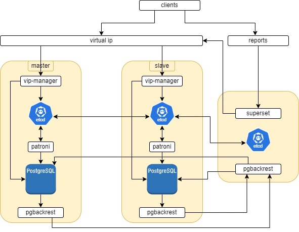

## Реализация отказоустойчевого кластера PostgreSQL для интернет магазина.

### Для реализации используется:
- 2 инстанса PostgreSQL под управлением Patroni
- 3 инстанса etcd для кворума и хранение конфигурации
- 2 инстанса vip-manager для единой точки подключения пользователей к БД
- 3 инстанса Pgbackrest для архивирования wal-файлов и создание резервных копий
- Superset для создания отчетов

### Принципиальная схема


### Состояние нод etcd и patroni
```
root@mysql001-otus:~# etcdctl endpoint health --cluster
http://192.168.88.60:2379 is healthy: successfully committed proposal: took = 1.973148ms
http://192.168.88.65:2379 is healthy: successfully committed proposal: took = 2.599321ms
http://192.168.88.64:2379 is healthy: successfully committed proposal: took = 2.65843ms
root@mysql001-otus:~# etcdctl endpoint status --cluster --write-out=table
+---------------------------+------------------+---------+---------+-----------+------------+-----------+------------+--------------------+--------+
|         ENDPOINT          |        ID        | VERSION | DB SIZE | IS LEADER | IS LEARNER | RAFT TERM | RAFT INDEX | RAFT APPLIED INDEX | ERRORS |
+---------------------------+------------------+---------+---------+-----------+------------+-----------+------------+--------------------+--------+
| http://192.168.88.64:2379 | 1c938984d2e351c2 |  3.4.30 |   98 kB |     false |      false |        20 |        320 |                320 |        |
| http://192.168.88.60:2379 | 6ea35c095e2a522b |  3.4.30 |   98 kB |      true |      false |        20 |        320 |                320 |        |
| http://192.168.88.65:2379 | 7543f4a133d1e671 |  3.4.30 |  115 kB |     false |      false |        20 |        320 |                320 |        |
+---------------------------+------------------+---------+---------+-----------+------------+-----------+------------+--------------------+--------+
```
```
root@pg0-otus:~# patronictl -c /etc/patroni/config.yml list
+ Cluster: otus (7476070226399082672) ---------+----+-----------+--------------+
| Member | Host          | Role    | State     | TL | Lag in MB | Tags         |
+--------+---------------+---------+-----------+----+-----------+--------------+
| pg0    | 192.168.88.65 | Replica | streaming |  5 |         0 | nosync: true |
| pg1    | 192.168.88.64 | Leader  | running   |  5 |           | nosync: true |
+--------+---------------+---------+-----------+----+-----------+--------------+
```
### Система резервного копирования
```
root@pg1-otus:~# sudo -u postgres psql -c "SELECT pg_walfile_name(pg_current_wal_lsn());"
could not change directory to "/root": Permission denied
     pg_walfile_name
--------------------------
 000000050000000000000015
(1 row)

root@mysql001-otus:~# pgbackrest info
P00   WARN: configuration file contains command-line only option 'config-include-path'
stanza: ishop
    status: ok
    cipher: none

    db (current)
        wal archive min/max (15): 000000020000000000000005/000000050000000000000014

        full backup: 20250227-181552F
            timestamp start/stop: 2025-02-27 18:15:52+03 / 2025-02-27 18:16:02+03
            wal start/stop: 00000004000000000000000F / 00000004000000000000000F
            database size: 30.1MB, database backup size: 30.1MB
            repo1: backup set size: 4.0MB, backup size: 4.0MB

        diff backup: 20250227-181552F_20250228-115058D
            timestamp start/stop: 2025-02-28 11:50:58+03 / 2025-02-28 11:51:03+03
            wal start/stop: 000000050000000000000012 / 000000050000000000000012
            database size: 94.1MB, database backup size: 69.3MB
            repo1: backup set size: 5.7MB, backup size: 2.2MB
            backup reference total: 1 full

        diff backup: 20250227-181552F_20250228-115156D
            timestamp start/stop: 2025-02-28 11:51:56+03 / 2025-02-28 11:52:02+03
            wal start/stop: 000000050000000000000014 / 000000050000000000000014
            database size: 94.1MB, database backup size: 69.3MB
            repo1: backup set size: 5.7MB, backup size: 2.2MB
            backup reference total: 1 full
```
### Структура БД

